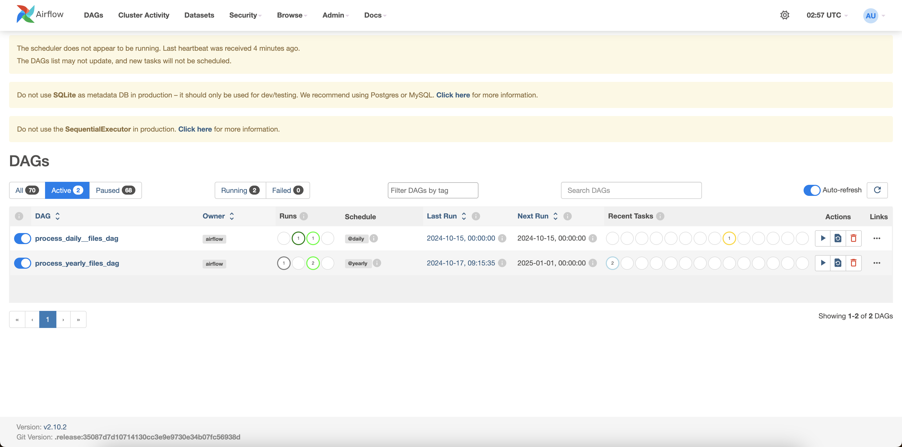
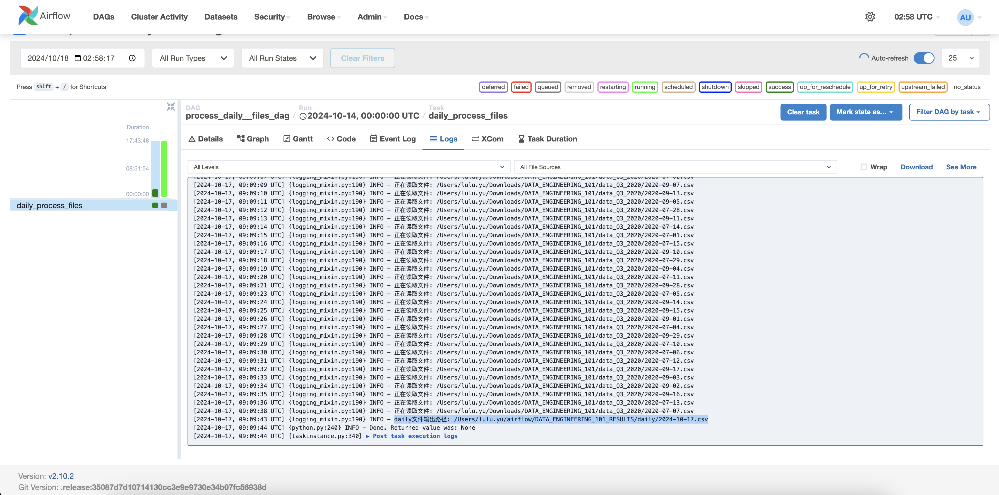

## 环境安装
-  pyhton 3.9.6
- pyspark 3.5.3
- airflow 2.10.2

## 数据下载
#### 数据范围2019 Q1 - 2023 Q3 s该demo选取的方式是将数据下载到本地，然后从本地加载数据的方式，代码中传入数据的响应的路径。

## airflow执行
#### 将drags文件夹中的文件下载下来放置到安装好的airflow文件夹下的/airflow/dags文件中。然后即可运行下列两行代码启动本地airflow服务：
- airflow webserver --port 8080
- airflow scheduler
#### 启动本地服务： http://localhost:8080/home
#### 即可看到对应的drags：

#### 可以点击进入到相应的drags看到具体的drag执行情况，并且可以看到对应的输出logs：

再去对应的饿输出路径找到相应的输出文件即可看到输出结果。